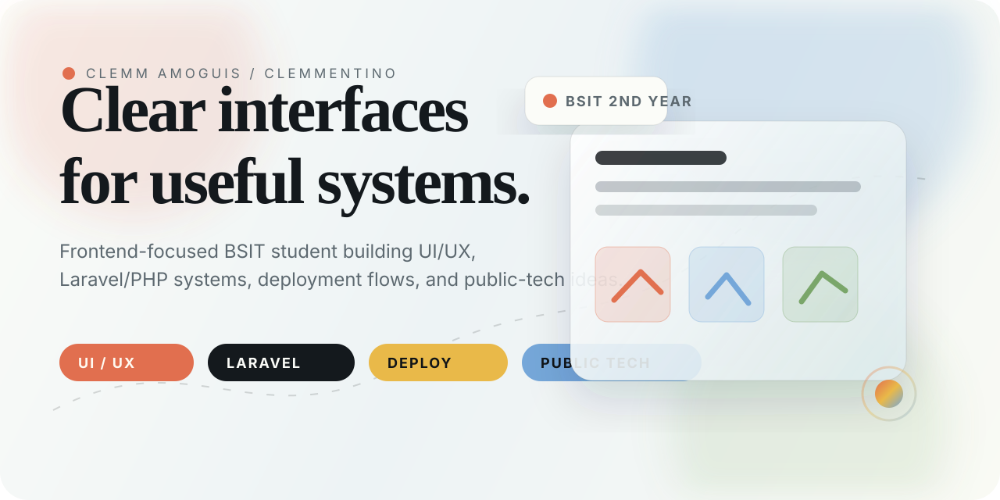
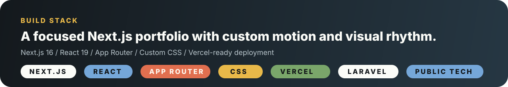
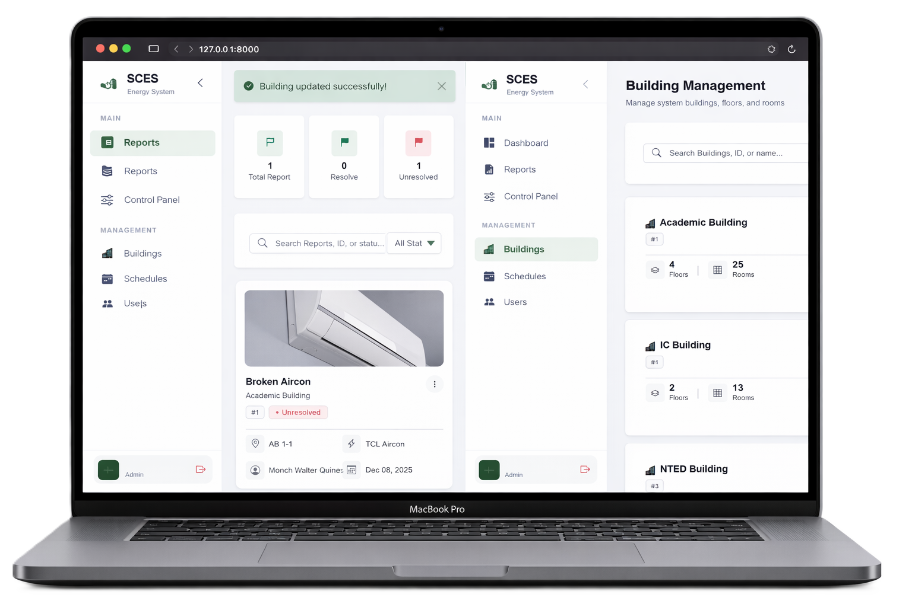
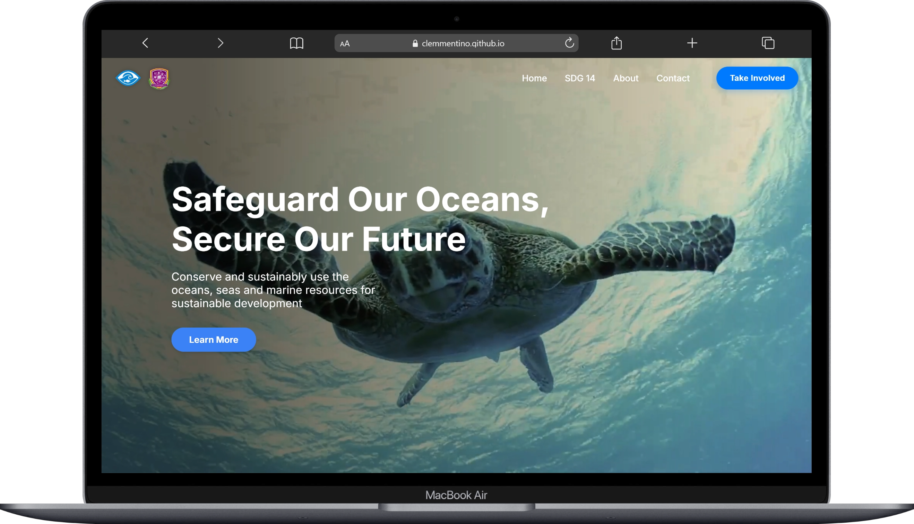
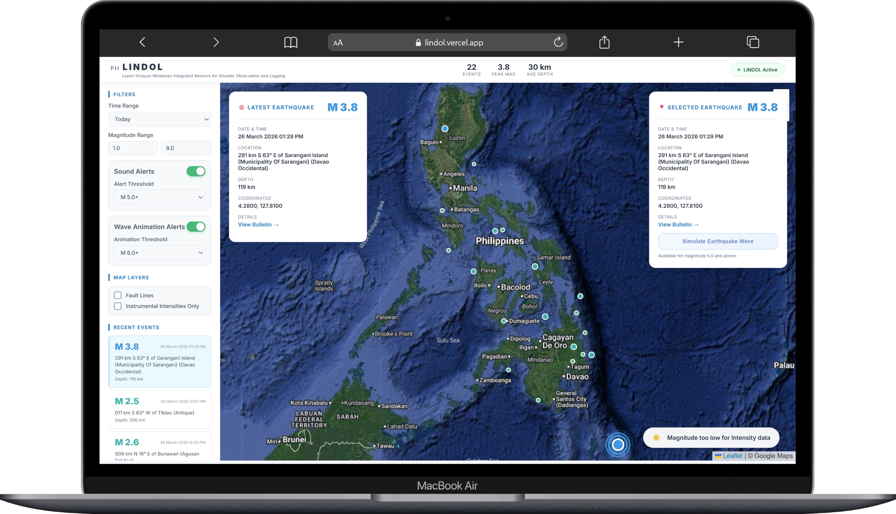

  

 

  
  
  

 

<table>
  <tr>
    <td width="38%">
      <h2>About Me</h2>
      

        I am <strong>Clemm Amoguis</strong>, also known as
        <strong>Clemmentino</strong>. I am a <strong>BSIT 2nd year student</strong>
        at <strong>Davao Del Norte State College</strong>, based in
        <strong>Panabo City</strong>.
      

      

        I enjoy improving UI/UX, arranging information clearly, and making
        frontend interfaces feel polished. I can also work with PHP, Laravel,
        deployment through Vercel or Render, and simple server setups using
        consumer-type computers.
      

    </td>
    <td width="62%">
      <table>
        <tr>
          <td align="center">
            <strong>Frontend</strong>
             
            UI/UX, layout, responsive screens
          </td>
          <td align="center">
            <strong>Backend</strong>
             
            PHP, Laravel, data flows
          </td>
        </tr>
        <tr>
          <td align="center">
            <strong>Deployment</strong>
             
            Vercel, Render, server setup
          </td>
          <td align="center">
            <strong>Direction</strong>
             
            Public tech, disaster-warning systems
          </td>
        </tr>
      </table>
    </td>
  </tr>
</table>

  

## Selected Work

<table>
  <tr>
    <td width="34%">
      
    </td>
    <td width="66%">
      <h3>Smart Campus Energy System</h3>
      

        A school energy-management platform shaped around dashboards, appliance
        states, room scheduling, consumption visibility, and operational feedback.
      

      

        
        
        
        
      

    </td>
  </tr>
  <tr>
    <td width="34%">
      
    </td>
    <td width="66%">
      <h3>OceanWatch</h3>
      

        An SDG 14 advocacy website built for readable marine-conservation content,
        publication access, volunteer entry points, and responsive browsing.
      

      

        
        
        
        
      

    </td>
  </tr>
  <tr>
    <td width="34%">
      
    </td>
    <td width="66%">
      <h3>LINDOL</h3>
      

        A Philippine earthquake-monitoring project with a static frontend, Flask
        backend, PHIVOLCS-backed data flow, map overlays, intensity views, and
        alert concepts.
      

      

        
        
        
        
      

    </td>
  </tr>
</table>

## Design Notes

<table>
  <tr>
    <td align="center" width="25%">
      <h3>01</h3>
      <strong>Personal</strong>
      
About section built around identity, student background, and real interests.

    </td>
    <td align="center" width="25%">
      <h3>02</h3>
      <strong>Visual</strong>
      
Portrait-led layout, project previews, soft gradients, and readable spacing.

    </td>
    <td align="center" width="25%">
      <h3>03</h3>
      <strong>Interactive</strong>
      
Theme switching, reveal motion, moving ticker, and scroll-progress feedback.

    </td>
    <td align="center" width="25%">
      <h3>04</h3>
      <strong>Practical</strong>
      
Built with a real stack and deployed like a working portfolio, not a mockup.

    </td>
  </tr>
</table>

## Run It

<table>
  <tr>
    <td width="50%">
      <strong>Install and develop</strong>
      <pre>npm install
npm run dev</pre>
    </td>
    <td width="50%">
      <strong>Production build</strong>
      <pre>npm run build</pre>
    </td>
  </tr>
</table>

## GitHub Motion

  
  

 

  <picture>
    <source media="(prefers-color-scheme: dark)" srcset="https://raw.githubusercontent.com/Clemmentino/Clemmentino-Portfolio/output/github-snake-dark.svg" />
    <source media="(prefers-color-scheme: light)" srcset="https://raw.githubusercontent.com/Clemmentino/Clemmentino-Portfolio/output/github-snake.svg" />
    
  </picture>

 

  <strong>Clemm Amoguis / Clemmentino</strong>
   
  Frontend-focused. Practical with systems. Interested in public-tech tools.

