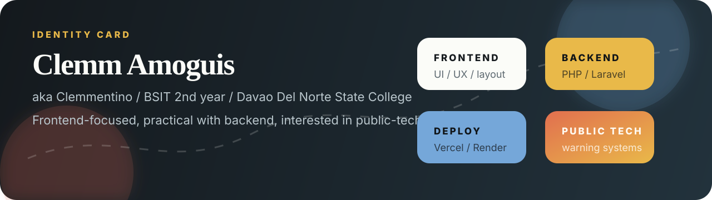
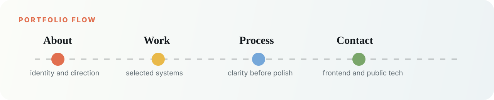

<div align="center">
  
</div>

<div align="center">
  <a href="https://clemmentino-portfolio.vercel.app">
    
  </a>
  <a href="mailto:mamoamoguis@gmail.com">
    
  </a>
  <a href="https://github.com/Clemmentino">
    
  </a>
</div>

<br />

<div align="center">
  
</div>

<br />

<table>
  <tr>
    <td width="33%" align="center">
      <h3>Frontend Craft</h3>
      <p>UI/UX, layout, responsive screens, hierarchy, and readable interfaces.</p>
    </td>
    <td width="33%" align="center">
      <h3>Practical Systems</h3>
      <p>PHP, Laravel, deployment, backend connections, and simple server setup.</p>
    </td>
    <td width="33%" align="center">
      <h3>Public-Tech Direction</h3>
      <p>Government tech, disaster-warning ideas, monitoring tools, and useful systems.</p>
    </td>
  </tr>
</table>

<div align="center">
  
</div>

<br />

<div align="center">
  
</div>

<br />

<div align="center">
  <h2>Selected Work</h2>
  <p>Three builds that show where the portfolio is headed: practical, visual, and useful.</p>
</div>

<table>
  <tr>
    <td width="46%">
      
    </td>
    <td width="54%">
      <h3>01 / Smart Campus Energy System</h3>
      <p>
        A school energy-management platform shaped around dashboards, appliance
        states, room scheduling, consumption visibility, and operational feedback.
      </p>
      <p>
        
        
        
      </p>
    </td>
  </tr>
</table>

<table>
  <tr>
    <td width="54%">
      <h3>02 / OceanWatch</h3>
      <p>
        An SDG 14 advocacy website built for readable marine-conservation
        content, publication access, volunteer entry points, and responsive
        browsing.
      </p>
      <p>
        
        
        
      </p>
    </td>
    <td width="46%">
      
    </td>
  </tr>
</table>

<table>
  <tr>
    <td width="46%">
      
    </td>
    <td width="54%">
      <h3>03 / LINDOL</h3>
      <p>
        A Philippine earthquake-monitoring project with a static frontend, Flask
        backend, PHIVOLCS-backed data flow, map overlays, intensity views, and
        alert concepts.
      </p>
      <p>
        
        
        
      </p>
    </td>
  </tr>
</table>

<br />

<div align="center">
  <h2>Inside The Build</h2>
</div>

<table>
  <tr>
    <td align="center" width="20%">
      <h3>Theme</h3>
      <p>Auto, light, soft, and dark modes.</p>
    </td>
    <td align="center" width="20%">
      <h3>Motion</h3>
      <p>Reveal transitions and scroll progress.</p>
    </td>
    <td align="center" width="20%">
      <h3>Ticker</h3>
      <p>Looping skills and interests strip.</p>
    </td>
    <td align="center" width="20%">
      <h3>About</h3>
      <p>Personal identity and focused strengths.</p>
    </td>
    <td align="center" width="20%">
      <h3>Work</h3>
      <p>Sticky project scenes with previews.</p>
    </td>
  </tr>
</table>

<details>
  <summary><strong>Run the portfolio locally</strong></summary>

  ```bash
  npm install
  npm run dev
  ```

  ```bash
  npm run build
  ```

</details>

<details>
  <summary><strong>Project structure</strong></summary>

  ```txt
  app/
    globals.css
    layout.js
    page.js

  components/
    portfolio-experience.jsx

  public/
    me.jpg
    readme-hero.svg
    readme-identity.svg
    readme-flow.svg
    readme-stack.svg
    scene-preview-a.png
    scene-preview-b.png
    scene-preview-c.png
    social-cover.png
  ```

</details>

<br />

<div align="center">
  <h2>GitHub Motion</h2>
  
  
</div>

<br />

<div align="center">
  <picture>
    <source media="(prefers-color-scheme: dark)" srcset="https://raw.githubusercontent.com/Clemmentino/Clemmentino-Portfolio/output/github-snake-dark.svg" />
    <source media="(prefers-color-scheme: light)" srcset="https://raw.githubusercontent.com/Clemmentino/Clemmentino-Portfolio/output/github-snake.svg" />
    
  </picture>
</div>

<br />

<div align="center">
  
</div>
