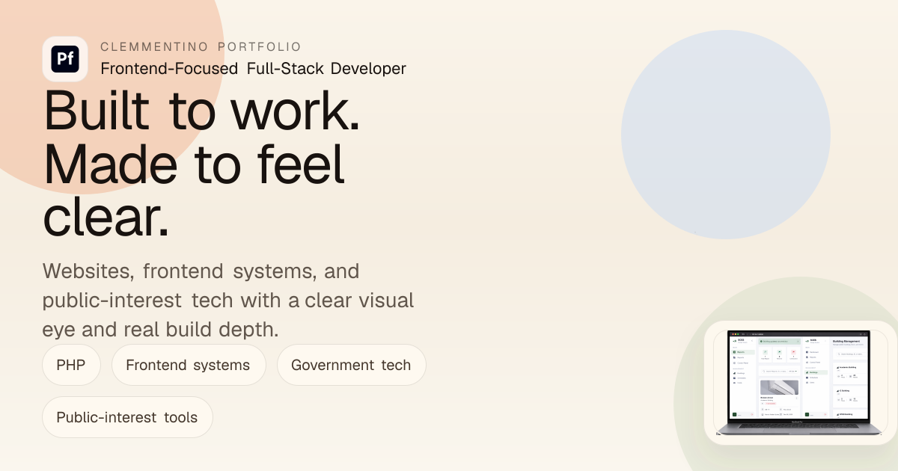

<div align="center">

  

  <br />
  <br />

  

  <p>
    <strong>Frontend-focused portfolio for UI/UX, practical systems, and public-interest technology.</strong>
  </p>

  <p>
    <a href="https://clemmentino-portfolio.vercel.app"><strong>Live Portfolio</strong></a>
    ·
    <a href="mailto:mamoamoguis@gmail.com"><strong>Email</strong></a>
    ·
    <a href="https://github.com/Clemmentino"><strong>GitHub</strong></a>
  </p>

</div>

---

## Identity

I am **Clemm Amoguis**, also known as **Clemmentino**. I am a BSIT 2nd year
student at **Davao Del Norte State College**, based in **Panabo City**.

This portfolio is built around the kind of work I want to be known for: clean
frontend interfaces, practical system thinking, and useful tools that can serve
real people. I can work with backend tasks using PHP and Laravel, deploy projects
through platforms like Vercel and Render, and set up consumer computers as simple
servers when a project needs a practical local setup.

What I enjoy most is improving UI/UX: making information easier to read,
arranging screens with better hierarchy, and giving a project a visual direction
that feels finished.

## Portfolio Preview

<table>
  <tr>
    <td width="50%">
      
    </td>
    <td width="50%">
      <h3>Smart Campus Energy System</h3>
      <p>
        A school energy management platform focused on appliance states,
        consumption visibility, room scheduling, dashboards, and operational
        feedback.
      </p>
      <p><strong>Stack:</strong> Laravel, Vue, PHP, Vite, Chart.js, FullCalendar</p>
    </td>
  </tr>
  <tr>
    <td width="50%">
      
    </td>
    <td width="50%">
      <h3>OceanWatch</h3>
      <p>
        An SDG 14 advocacy website designed for readable marine-conservation
        content, publication access, volunteer entry points, and responsive
        browsing.
      </p>
      <p><strong>Stack:</strong> HTML, CSS, JavaScript, Bootstrap</p>
    </td>
  </tr>
  <tr>
    <td width="50%">
      
    </td>
    <td width="50%">
      <h3>LINDOL</h3>
      <p>
        A Philippine earthquake monitoring project with a static frontend, Flask
        backend, PHIVOLCS-backed data flow, map overlays, intensity views, and
        alert concepts.
      </p>
      <p><strong>Stack:</strong> Flask, Leaflet, PHIVOLCS data flow, Vercel, Render</p>
    </td>
  </tr>
</table>

## Design System

| Layer | Direction |
| --- | --- |
| **Layout** | Editorial sections, sticky selected-work cards, portrait-led About Me |
| **Motion** | Scroll reveal, moving skill ticker, theme transitions |
| **Theme** | Light, soft, dark, and automatic time-based theme preference |
| **Tone** | Professional but warm, personal without feeling too casual |
| **Visual Input** | Photography and videography influence composition and pacing |

## Build Stack

<p>
  
  
  
  
</p>

```txt
Next.js 16
React 19
App Router
Custom CSS
Vercel-ready deployment
```

## Local Development

```bash
npm install
npm run dev
```

Production build:

```bash
npm run build
```

## Project Map

```txt
app/
  globals.css        # themes, layout system, animation, responsive styles
  layout.js          # metadata, fonts, theme init
  page.js            # app entry

components/
  portfolio-experience.jsx

public/
  me.jpg
  scene-preview-a.png
  scene-preview-b.png
  scene-preview-c.png
  social-cover.png
```

## GitHub Activity

<div align="center">

  
  

</div>

## Contribution Slither

The contribution snake is generated by GitHub Actions and published to the
`output` branch. It updates on schedule after the workflow runs.

<div align="center">

  <picture>
    <source media="(prefers-color-scheme: dark)" srcset="https://raw.githubusercontent.com/Clemmentino/Clemmentino-Portfolio/output/github-snake-dark.svg" />
    <source media="(prefers-color-scheme: light)" srcset="https://raw.githubusercontent.com/Clemmentino/Clemmentino-Portfolio/output/github-snake.svg" />
    
  </picture>

</div>

<details>
  <summary><strong>What This Portfolio Is Trying To Prove</strong></summary>

  This project is meant to show that I can think beyond making something merely
  work. I want the interface to feel organized, the content to sound personal,
  and the system to be practical enough for real use. Frontend is the main
  direction, but backend connection, deployment, and practical setup are part of
  how I understand a complete project.

</details>

---

<div align="center">

  <strong>Built by Clemm Amoguis, aka Clemmentino.</strong>
  <br />
  Frontend-focused. Practical with systems. Interested in public-tech tools.

</div>
